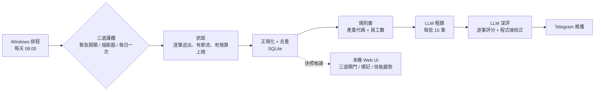

# 104 職缺日報：自動化求職資料管線

> 我自己求職用的系統。每天早上自動抓取 104 職缺，依產業和公司規模過濾，再用 LLM 對照我的履歷評分，最後推播到手機。
> 每週一在本機的 Web UI 決定這週要投哪幾家。
> 從 2026-08-22 起每天實際運作至今，不是課堂作業或 demo。

**技術**：Python 3.12 · httpx · SQLite · Pydantic · OpenRouter（Gemini）· Streamlit · pytest · Windows 工作排程器

---

## 30 秒看懂

| | |
|---|---|
| **解決什麼問題** | 104 每天有上百筆新職缺，大部分跟我的方向（資料工程、半導體或金融大廠）無關。人工逐筆看，一天要花一小時。 |
| **做了什麼** | 一條每日自動執行的資料管線，包含抓取、清洗、去重、規則過濾、LLM 評分和推播四段。另外有一個本機 Web UI，用來標記、匯出，也做技能趨勢分析。 |
| **最在意什麼** | **不能給資料來源添麻煩。** 每天只跑一次，請求逐筆送出並有節流；程式不登入帳號；一遇到封鎖訊號就停止，不重試。 |
| **資料工程的部分** | 把對方未公開文件的 API 回應，轉成穩定的領域模型。資料格式改變時系統會偵測到並告警，欄位缺失時會降級運作，並有可重跑的離線管線與超過 400 個離線測試。 |

## 實際跑出來的數字

以下數字來自系統自己的資料庫，統計期間是 2026-08-22 到 2026-09-26：

| 項目 | 數字 |
|---|---|
| 實際連線 104 抓取 | **25 次**，橫跨 36 天 |
| 累計入庫職缺 | **1,788** 筆，其中 373 筆抓了完整 JD |
| LLM 深度評分 | **650** 筆 |
| 推播到手機 | **146** 筆，約為入庫量的 8% |
| 每次執行的 LLM 成本 | 平均 **US$0.048**，25 次合計 US$1.19 |
| 每次執行的請求數 | 硬上限 40 個，實測最高 40 個（上限確實有擋住） |
| 程式規模 | 58 個模組、約 8,200 行，另有約 4,600 行測試 |
| 自動化測試 | **495 個，全部離線執行**，使用錄下來的真實 104 回應 |

---

## 系統架構

- **流程編排不做任何 IO。** 抓取、評分、推播都定義成介面，再注入實作。抓取方式曾經從「真實瀏覽器」整個換成「純 HTTP」，流程、儲存、評分、推播的程式一行都沒改。
- **只有一個模組認識 104 的 JSON 結構**（`normalize.py`）。對方改版時只需要改這一個地方，而且會被偵測並告警，不會悄悄算錯。

---

## 幾個有代表性的工程判斷

這個專案花最多時間的地方不在寫程式，而在**先量測、再下結論**。以下是四個例子。

### 1. 問題表面上是關鍵字，實際上在資料本身：改用產業代碼過濾

**現象**：搜尋關鍵字已經全部換成「資料工程師」這一類，推播出來的仍然大多是 AI 工程師職缺。

**查證**：104 的關鍵字搜尋是**全文模糊比對**，JD 裡只要提到「資料工程」就會被撈回來。所以換關鍵字沒有用。我也試過用 104 的「職務類別」代碼過濾，但驗證後發現雇主常常掛錯類別，硬篩會把當天最好的職缺刪掉，留下的反而是 AI 職缺。

**做法**：改用**產業代碼前綴加上員工數**過濾。公司屬於哪個產業，雇主沒有理由亂填。過濾放在我方程式端，不放在 104 的搜尋參數裡：兩種做法的請求數完全一樣，但程式端過濾不需要對 104 多做任何測試請求，也能完全離線測試。

**結果**：在某一天的實際資料上，原本 10 則推播裡有 8 則是不相關的 AI 職缺，改完後這 8 則全部被擋下。

### 2. 用 LLM 分數當門檻之前，先量雜訊

同一份資料、同一個 prompt 連跑兩次，當天最好的職缺一次得 80 分、一次得 88 分。**雜訊大約 ±8 分，而原本的門檻正好是 80。** 也就是說，最好的職缺會隨機出現或消失，而且從外面看起來就只是「今天沒有好缺」，沒有任何跡象可以察覺。

所以我把絕對門檻改成**當天分數排名的前 N 名**，雜訊只會影響排序。另外設一個遠低於雜訊範圍的下限，只用來擋掉明顯不合適的職缺。

### 3. 不讓模型自己算分數：核心條件一票否決

「履歷命中了幾成必備條件」這件事，LLM 只負責逐條判定「符合、部分符合、不符合」並附上證據，**百分比由程式計算**。另外，每筆職缺最多標出 2 條核心條件，只要有一條不完全符合，就直接判定不通過。

會加這條規則，是因為有一筆實例：平均命中率算出來是 88%，我自己判斷只有約 61%，差距正好出在「沒用過該職位的主要雲端平台」這一條。只看平均數，會把這種致命缺口稀釋掉。

### 4. 雲端能不能跑：量測後結論是不行

原本計畫部署在雲端（Modal）。實測結果：

- 從雲端資料中心的 IP 連線，會被 Cloudflare 擋下並要求驗證。
- 改用真實瀏覽器，反而被升級成需要人工操作的驗證。
- 從台灣住宅 IP 連線則完全暢通。

也就是說，擋下來的原因是 **IP 信譽**，不是抓取的技術手法。我沒有嘗試繞過驗證，而是把系統改成在本機排程執行，雲端版本的程式碼則完整保留，等有合規的連線方式再切回去。這個專案前後錯判過兩次，兩次方向還相反，過程都記錄在 [CLAUDE.md](CLAUDE.md)。

---

## 對資料來源負責：護欄設計

這些護欄的優先順序高於功能。互相衝突時，**寧可少抓幾筆職缺，也不冒險**。

- **不登入。** 目標資料對未登入的訪客完全公開，登入沒有任何好處。設定檔裡只要出現 `password` 之類的欄位，程式就拒絕啟動。
- **所有請求都要先經過同一個守門員**（`RequestBudget.acquire()`）。它負責節流（每個請求至少間隔 3 秒）、計數，並擋下黑名單路徑，例如任何跟投遞相關的網址。
- **上限只能往保守的方向調。** 每頁數、詳細頁數、請求總數都有寫死在程式裡的上限，設定值超過就拒絕啟動。
- **遇到封鎖訊號立刻停止，不重試。** 出現 429、503 或驗證頁時，當次執行直接中止並啟動熔斷器，冷卻時間是 24 小時，第二次是 72 小時，第三次之後要人工解除。
- **能分辨「被擋」和「我方設定錯誤」。** 同樣是 403，回應內容是空的代表我方設定有問題，這時只告警、不熔斷；出現驗證頁才是真的被擋。兩者的處理方式剛好相反。
- **遵守 robots.txt。** 不使用 robots.txt 禁止的查詢參數，由程式強制檢查。
- **護欄本身都有測試。** 沒有測試的護欄等於不存在。

---

## Web UI：把分數變成決策

在本機執行，只綁定 `127.0.0.1`，並以唯讀快照讀取資料庫。

*候選清單。點選一筆職缺後，左下方逐條列出必備條件的判定和履歷上的證據，右下方是 104 的原文，可以直接對照。*

- **候選清單**：三道閘門依序是硬門檻、想不想去、必備命中率，每筆職缺都顯示卡在第幾道。可以標記「投」、「不投」、「待確認」；選「不投」時必須填原因，這些原因之後可以用來回頭檢討閘門設得對不對。清單可匯出成 Markdown 或 CSV。
- **已標投遞**：列出確定要投的職缺，並依照 JD 條件和履歷的落差，產生履歷修改建議。
- **技能趨勢**：統計職缺要求的技能，可以依產業、職稱、時間切分。全部職缺的「摘要層」和有完整 JD 的「全文層」**分開統計**，每張圖都標示樣本數和偏誤來源，避免把樣本偏誤誤當成市場趨勢。

*技能趨勢（半導體／電子 × 資料工程）。每張圖都標示樣本數；全文層樣本太少時會直接顯示警告。*

有一個設計決策值得一提：Web UI 的標記存在**另一個獨立的資料庫**。原因是主管線結束時會整檔覆寫主資料庫；UI 如果直接開著那個檔案，在 Windows 上覆寫會失敗，當天的資料就會悄悄遺失。完整理由記錄在 [ADR 0001](docs/adr/0001-decisions-in-separate-db.md)。

---

## 延伸閱讀

| 文件 | 內容 |
|---|---|
| [README-dev.md](README-dev.md) | 安裝、啟用、日常維運（給想跑起來的人） |
| [SPEC.md](SPEC.md) | 需求規格、驗收標準、合規評估 |
| [CONTEXT.md](CONTEXT.md) | 領域詞彙表（閘門、規則層、命中率……） |
| [docs/adr/](docs/adr/) | 架構決策紀錄 |
| [CLAUDE.md](CLAUDE.md) | 專案上下文、已踩過的坑、104 API 的實測欄位 |

> 本專案僅供個人求職自用，每天執行一次，不對外發布任何抓取到的資料。
